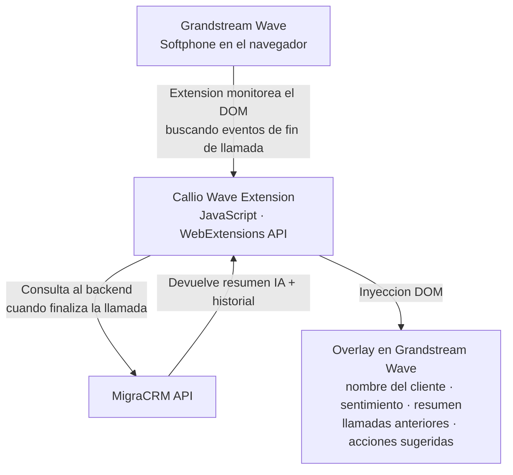

# Callio Wave Add-in

 

> **Extension de navegador para el softphone Grandstream Wave que muestra resumenes de llamadas con IA e historial del cliente en tiempo real — en el momento exacto en que termina la llamada.**

> Este es un **portfolio showcase** — el codigo fuente es propietario y no esta incluido.

---

## El Problema

Cuando los agentes de call center usando Grandstream Wave terminaban una llamada, tenian que:

1. Cambiar manualmente a la pestana del CRM
2. Buscar al cliente por numero de telefono
3. Leer notas anteriores para obtener contexto
4. Escribir su propio resumen de lo que se trato

Este cambio de contexto era lento, propenso a errores, e interrumpia el flujo del agente en el momento exacto en que necesitaba tomar accion.

---

## La Solucion

Callio Wave Add-in es una extension de navegador que **detecta automaticamente cuando termina una llamada** en la pestana del softphone Grandstream Wave y muestra inmediatamente un overlay flotante con:

- El resumen de la llamada generado por IA (desde [MigraCRM](https://github.com/deadlyrat/migra-crm-showcase))
- Historial del cliente (llamadas anteriores, notas, acciones pendientes)
- Proximas acciones sugeridas

Sin cambiar de pestana. Sin buscar. Todo en el momento indicado.

---

## Funcionamiento

---

## Funcionalidades

| Funcionalidad | Descripcion |
|--------------|-------------|
| Deteccion de fin de llamada | Monitorea el DOM de Grandstream Wave para eventos de cierre de llamada |
| Overlay con resumen IA | Muestra el resumen generado por Gemini directamente en la interfaz del softphone |
| Historial del cliente | Muestra interacciones previas, notas y registros CDR del cliente |
| Acciones sugeridas | Presenta los proximos pasos sugeridos por el analisis de IA |
| Cero friccion | Sin disparo manual — el overlay aparece automaticamente al finalizar la llamada |

---

## Stack Tecnologico

| Componente | Tecnologia |
|-----------|-----------|
| Extension | JavaScript Vanilla · WebExtensions API (Chrome/Firefox) |
| Integracion backend | REST polling contra la API de [MigraCRM](https://github.com/deadlyrat/migra-crm-showcase) |
| Renderizado | Inyeccion DOM en la interfaz de Grandstream Wave |

---

## Relacion con MigraCRM

Esta extension es un complemento de **MigraCRM** — no tiene valor de forma independiente. Los resumenes con IA y el historial del cliente que muestra son producidos por MigraCRM.

Ver [migra-crm-showcase](https://github.com/deadlyrat/migra-crm-showcase) para la arquitectura completa del sistema.

---

## Capturas de Pantalla

> Capturas disponibles bajo solicitud — contactar para demo.

---

## Contacto

El codigo fuente es propietario. Para consultas: [pablozam1931@gmail.com](mailto:pablozam1931@gmail.com)

---

*Parte del portfolio [deadlyrat](https://github.com/deadlyrat).*
