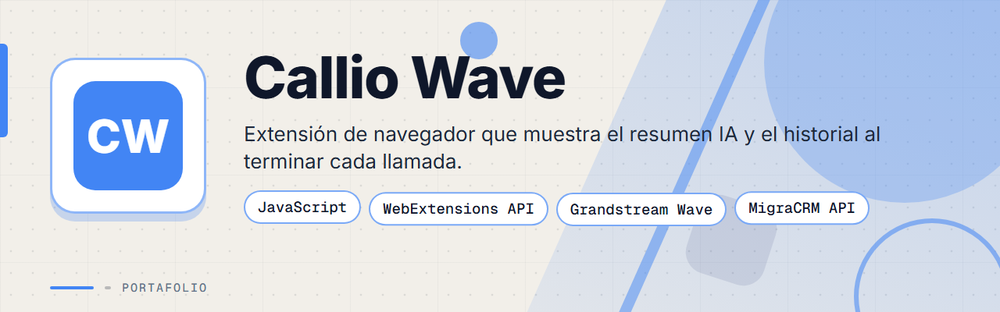
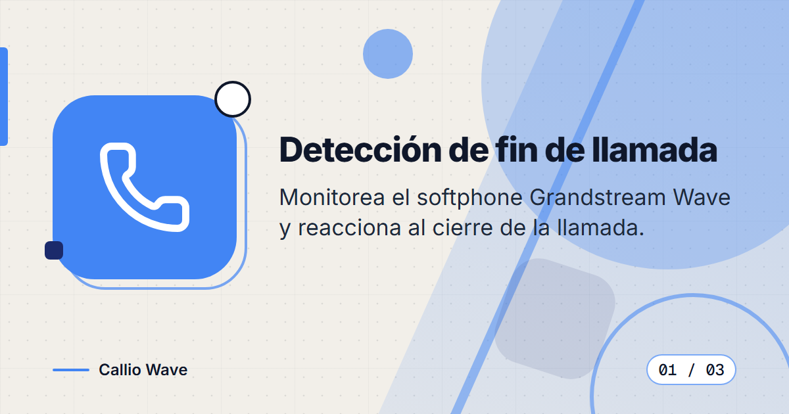
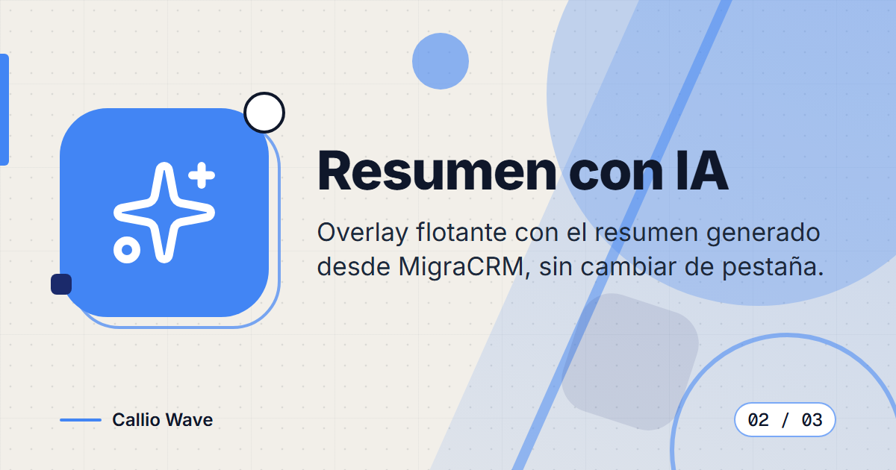
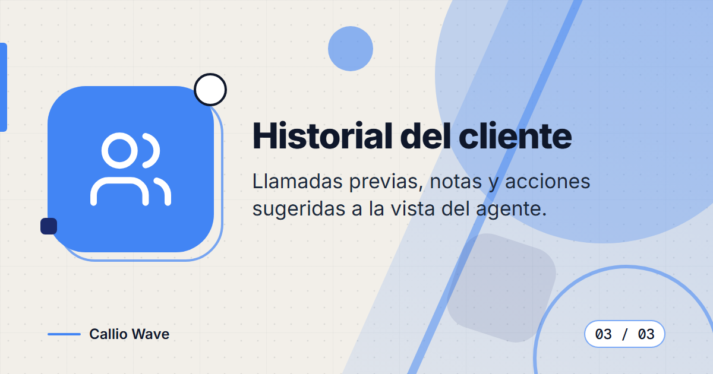
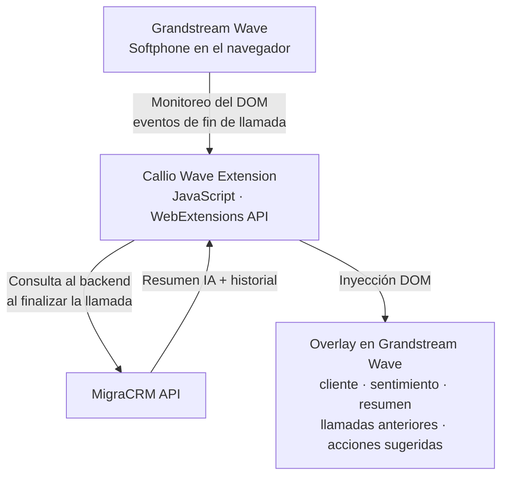

# Callio Wave Add-in

**Extensión de navegador para el softphone Grandstream Wave que muestra resúmenes de llamadas con IA e historial del cliente en tiempo real, en el momento exacto en que termina la llamada.**

> Este es un **portafolio showcase**: el código fuente es propietario y no está incluido.

---

## Contenido

- [El Problema](#el-problema)
- [La Solución](#la-solución)
- [Funcionalidades](#funcionalidades)
- [Vista Previa](#vista-previa)
- [Arquitectura](#arquitectura)
- [Stack Tecnológico](#stack-tecnológico)
- [Instalación local](#instalación-local)
- [Roadmap](#roadmap)
- [Contacto](#contacto)

---

## El Problema

Cuando los agentes de call center que usan Grandstream Wave terminaban una llamada, tenían que:

1. Cambiar manualmente a la pestaña del CRM.
2. Buscar al cliente por número de teléfono.
3. Leer notas anteriores para obtener contexto.
4. Escribir su propio resumen de lo que se trató.

Este cambio de contexto era lento, propenso a errores e interrumpía el flujo del agente en el momento exacto en que necesitaba tomar acción.

---

## La Solución

Callio Wave Add-in es una extensión de navegador que **detecta automáticamente cuando termina una llamada** en la pestaña del softphone Grandstream Wave y muestra de inmediato un overlay flotante con:

- El resumen de la llamada generado por IA (desde [MigraCRM](https://github.com/deadlyrat/migra-crm-showcase)).
- El historial del cliente (llamadas anteriores, notas, acciones pendientes).
- Las próximas acciones sugeridas.

Sin cambiar de pestaña. Sin buscar. Todo en el momento indicado.

Es un complemento de **MigraCRM**: los resúmenes con IA y el historial que muestra son producidos por ese sistema. Consulta [migra-crm-showcase](https://github.com/deadlyrat/migra-crm-showcase) para ver la arquitectura completa.

---

## Funcionalidades

| Funcionalidad | Descripción |
|---------------|-------------|
| Detección de fin de llamada | Monitorea el DOM de Grandstream Wave para detectar los eventos de cierre de llamada |
| Overlay con resumen IA | Muestra el resumen generado por Gemini directamente en la interfaz del softphone |
| Historial del cliente | Muestra interacciones previas, notas y registros CDR del cliente |
| Acciones sugeridas | Presenta los próximos pasos sugeridos por el análisis de IA |
| Cero fricción | Sin disparo manual: el overlay aparece automáticamente al finalizar la llamada |

---

## Vista Previa

<table>
  <tr>
    <td width="50%">
      
       <b>Detección de fin de llamada</b>: la extensión detecta el cierre de la llamada sin intervención del agente.
    </td>
    <td width="50%">
      
       <b>Resumen con IA</b>: el overlay muestra el resumen de la llamada generado por IA.
    </td>
  </tr>
  <tr>
    <td width="50%">
      
       <b>Historial del cliente</b>: llamadas anteriores, notas y acciones sugeridas en el mismo lugar.
    </td>
    <td width="50%"></td>
  </tr>
</table>

---

## Arquitectura

---

## Stack Tecnológico

| Capa | Tecnología |
|------|-----------|
| Extensión | JavaScript Vanilla · WebExtensions API (Chrome/Firefox) |
| Integración backend | REST polling contra la API de [MigraCRM](https://github.com/deadlyrat/migra-crm-showcase) |
| Renderizado | Inyección DOM en la interfaz de Grandstream Wave |

---

## Instalación local

> **Aviso:** el código es privado y propietario. La extensión se distribuye solo a colaboradores autorizados con acceso al repositorio.

1. Obtén el código de la extensión mediante acceso autorizado.
2. Carga la extensión sin empaquetar desde la página de extensiones de tu navegador (Chrome o Firefox) con el modo desarrollador activado.
3. Configura la conexión a tu instancia de MigraCRM con tus propios valores.
4. Abre Grandstream Wave en el navegador y finaliza una llamada para ver el overlay.

---

## Roadmap

- [ ] Publicar capturas del overlay en vivo sobre la interfaz de Grandstream Wave.

---

## Contacto

El código fuente es propietario. Para consultas o propuestas, escríbeme:

[%206517--1870-25D366?style=for-the-badge&logo=whatsapp&logoColor=white)](https://wa.me/50765171870)

- Correo: [pablozam1931@gmail.com](mailto:pablozam1931@gmail.com)
- WhatsApp: [(507) 6517-1870](https://wa.me/50765171870)
- GitHub: [github.com/deadlyrat](https://github.com/deadlyrat)

---

*Parte del portafolio de [deadlyrat](https://github.com/deadlyrat)*
